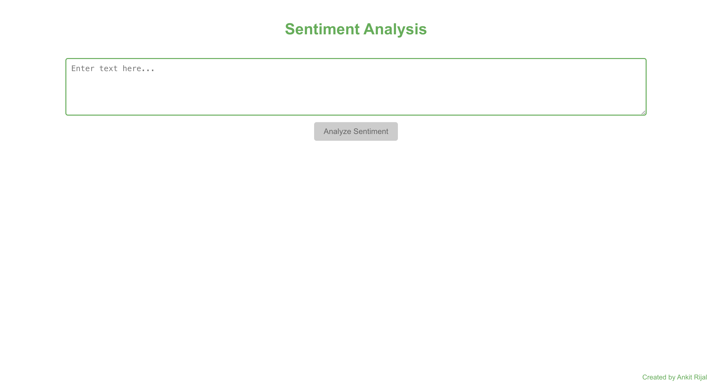
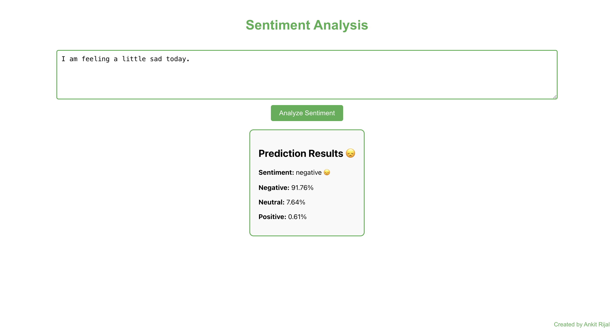

# 📝 Sentiment Analysis Web App

## Overview

The Sentiment Analysis Web App is a responsive web application that analyzes the sentiment of user-input text using a pre-trained RoBERTa model from Hugging Face Transformers. It features a Flask backend with a ReactJS frontend, optimized for accuracy and performance.

## Features

- **Sentiment Analysis:** Uses a pre-trained RoBERTa model to classify text as positive, negative, or neutral.
- **Interactive UI:** Built with ReactJS for a seamless and dynamic user experience.
- **Real-time Analysis:** Provides immediate feedback on user-input text.
- **Cross-Origin Communication:** Ensured using Flask-CORS for smooth API interactions.
- **Optimized Performance:** Utilizes SoftMax for classification and a robust backend design.

## Screenshots

### Main Interface



### Sentiment Details



## Technologies Used

- **Backend:** Python, Flask
- **Frontend:** ReactJS
- **Machine Learning Model:** Hugging Face Transformers (RoBERTa)
- **CORS Handling:** Flask-CORS
- **Optimization:** SciPy

## Installation

### Prerequisites

Ensure you have the following installed:

- Python 3.x
- Node.js and npm
- Flask
- ReactJS

### Backend Setup

1. Clone the repository:
   ```bash
   git clone https://github.com/ankitrijal2054/Sentiment_Web_App.git
   cd sentiment-analysis-web-app/backend
   ```
2. Create a virtual environment:
   ```bash
   python -m venv venv
   source venv/bin/activate   # On Windows use `venv\Scripts\activate`
   ```
3. Install dependencies:
   ```bash
   pip install -r requirements.txt
   ```
4. Run the Flask server:
   ```bash
   python app.py
   ```

### Frontend Setup

1. Navigate to the frontend directory:
   ```bash
   cd ../frontend
   ```
2. Install dependencies:
   ```bash
   npm install
   ```
3. Start the React app:
   ```bash
   npm start
   ```

## Usage

1. Enter a text input in the provided field.
2. The app analyzes the sentiment using the RoBERTa model.
3. The result is displayed in real-time, indicating whether the sentiment is positive, negative, or neutral.

## Visit the Live App

You can check out the deployed Sentiment Analysis Web App here:
[Sentiment Analysis Live](https://sentiment-analysis-455b.onrender.com/)

## Future Improvements

- **Enhance model accuracy with fine-tuned training on a custom dataset.**
- **Implement additional language support for multilingual sentiment analysis.**
- **Introduce data visualization for sentiment trends over time.**

## Deployment

- The backend is deployed using **Render**.
- The frontend can be hosted using **GitHub Pages** or **Vercel**.

## Contributing

Contributions are welcome! Feel free to fork the repository and submit a pull request.

## License

This project is licensed under the MIT License.

## Contact

For any questions or suggestions, feel free to reach out!

- **GitHub:** [ankitrijal2054](https://github.com//ankitrijal2054)
- **Email:** ankitrijal2054@gmail.com
